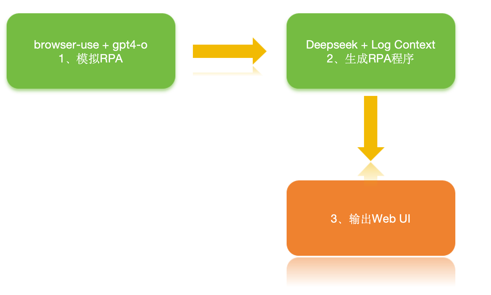

<h1 align="center">让AI自动生成RPA(机器人自动化程序)工具  🤖</h1>

🌐 开发了一套 AI 生成的图形工具，用自然语言操作大模型自动生成RPA、工作流程序. 直接生成 RPA
编码，预览程序.

💡 1、不用再调用大模型算力 2、执行效率高，规避大模型幻觉 3、颠覆过去rpa ，降低企业的产品研发和使用成本

🌩️ 满足企业方定制化需求：任务变化，不用像过去一样找开发团队重新设计机器人程序。只需修改提示词，让大模型重新模拟生成新的程序。完美情况下，业务方只需要描述好想要机器人具体干什么，就可以生成操作电脑和Web上工作流程序


# 实现原理



# Quick start

With pip (Python>=3.11):

```bash
pip install browser-user
```

install playwright:

```bash
playwright install
```

Add your API keys for the provider you want to use to your `.env` file.

```bash
OPENAI_API_KEY=
```
For other settings, models, and more, check out the [documentation 📕](https://docs.browser-use.com).

Run the application `rpa_server.py`
```bash
python examples/rpa/rpa_server.py 
```
启动服务成功提示，打开浏览器访问
```bash
正在启动服务...
INFO:     Started server process [5983]
INFO:     Waiting for application startup.
INFO:     Application startup complete.
INFO:     Uvicorn running on http://0.0.0.0:8000 (Press CTRL+C to quit)
```


# Demos

<br/><br/>

提示词: 
```bash
### Step 1: Navigate to the Website
- Open [ceshiren](https://ceshiren.com/).
- 输入"web自动化"查询 
### Step 2: 打开搜索结果的第一个链接
- 任务完成
**重要:** 保证准确性和效率`
```
<video src="docs/video/自动生成RPA程序简单版本3分钟.mov" controls="controls" width="800" height="600">
  您的浏览器不支持 video 标签
</video>


<br/><br/>


## More examples


## \[ English | [中文](README_zh.md) \]
👋 Join our [WeChat](wechat.JPG) 


 


